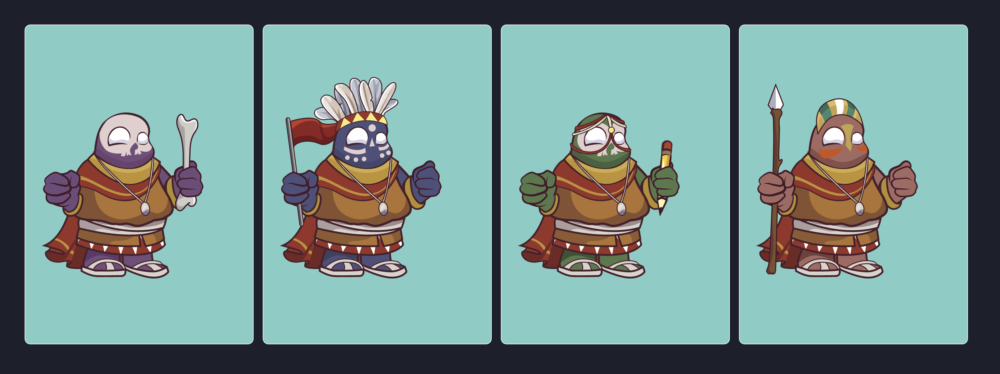

# RMRK2 Examples

This repository showcases a collection of examples on how to use RMRK2 in it's current implementation (using `system.remark` exstrinsic)
You can find Crowdcast demo of using this code here: https://www.crowdcast.io/e/buid

This example shows how to create a composable NFT using [Base](https://github.com/rmrk-team/rmrk-spec/blob/2.0-wip/standards/rmrk2.0.0/entities/base.md) entity of type SVG. As well as nested NFTs equippable into chunky hands

## Scripts

Under `/projects/scripts` you can find all the minting scripts that you can run from CLI

## React demo

Under `/projects/react-demo` you can find a simple Next.js react app and an example of SVG composer component that composes single image from all the Base parts and nested NFTs of each parent Chunky
